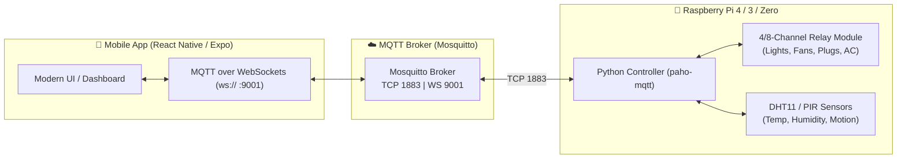

# 🏠 Smart Home Automation System

[](LICENSE)
[](mobile-app/)
[](raspberry-pi/)
[](broker/)
[](.github/workflows/ci.yml)

A complete, production-grade **Smart Home Automation System** connecting a cross-platform **React Native (Expo)** mobile app with a **Raspberry Pi** hardware controller over **MQTT**.

Designed with **strict minimal permissions** (only network access required—no intrusive location, camera, or contact permissions).

---

## 🏗️ Architecture Overview



---

## 🔒 Strict Minimal Permissions

Unlike traditional smart home applications that demand unnecessary system access, this app requests **strictly minimal permissions**:

| Platform | Permission | Why it is needed |
| :--- | :--- | :--- |
| **Android** | `android.permission.INTERNET` | Connect to MQTT broker via WebSockets |
| **Android** | `android.permission.ACCESS_NETWORK_STATE` | Detect Wi-Fi / cellular online status |
| **Android** | `android.permission.CAMERA` | Strictly required to toggle physical phone flashlight / torch LED |
| **iOS** | `NSCameraUsageDescription` | Strictly used to toggle physical phone flashlight / torch |

> [!NOTE]
> **Zero invasive permissions**: No GPS/Fine Location, No Photo Library access, No Microphone, No Contacts, and No Storage access.

---

## 📁 Repository Structure

```
.
├── .github/
│   └── workflows/
│       └── ci.yml               # Automated TypeScript & Python syntax CI
├── broker/
│   ├── docker-compose.yml       # 1-command Mosquitto broker setup
│   └── mosquitto.conf           # Config with TCP 1883 & WebSockets 9001
├── mobile-app/
│   ├── src/
│   │   ├── components/          # Header, SensorCard, DeviceCard, QuickScenes, Settings, TorchController
│   │   ├── constants/           # Device & Room configurations
│   │   ├── services/            # Paho MQTT client wrapper & event bus
│   │   └── types/               # TypeScript interfaces
│   ├── App.tsx                  # Main smart home dashboard with flashlight toggle
│   ├── app.json                 # Minimal permission manifest
│   └── package.json
├── raspberry-pi/
│   ├── config.yaml              # GPIO pin mappings & MQTT topics
│   ├── controller.py            # Python hardware daemon with simulated fallback
│   ├── requirements.txt         # Python dependencies
│   ├── setup_pi.sh              # 1-command install script for Raspberry Pi OS
│   └── smart-home.service       # Systemd auto-start service
├── laptop_controller.py         # Laptop CLI & Web Dashboard to control phone & appliances
├── .gitignore                   # Clean ignore rules (no node_modules, .env, pycache)
├── .env.example                 # Environment variable template
├── LICENSE                      # MIT Open Source License
└── README.md
```

---

## 🚀 Quick Start Guide

### 1. Start the MQTT Broker

You can host Mosquitto on your PC, Raspberry Pi, or local server using Docker:

```bash
cd broker
docker compose up -d
```

*Port `1883` handles standard MQTT (used by Raspberry Pi).*  
*Port `9001` handles MQTT over WebSockets (used by the Mobile App).*

*(Alternatively, you can test immediately with public brokers like `broker.emqx.io` with port `8083` without running any server!)*

---

### 2. Set Up the Raspberry Pi

1. Clone this repository onto your Raspberry Pi:
   ```bash
   git clone https://github.com/<your-username>/<your-repo-name>.git
   cd <your-repo-name>/raspberry-pi
   ```

2. Run the automated installer:
   ```bash
   chmod +x setup_pi.sh
   ./setup_pi.sh
   ```

3. **Or run manually**:
   ```bash
   pip3 install -r requirements.txt
   python3 controller.py
   ```

> [!TIP]
> If you run `controller.py` on your Windows/Mac/Linux laptop, it will automatically enter **Simulated Development Mode**, allowing you to test app interactions without any physical hardware!

#### Hardware Pinout (BCM Numbering):

| Device | Type | GPIO Pin | Physical Pin |
| :--- | :--- | :--- | :--- |
| Living Room Light | Relay Ch 1 | `GPIO 17` | Pin 11 |
| Bedroom Light | Relay Ch 2 | `GPIO 27` | Pin 13 |
| Kitchen Light | Relay Ch 3 | `GPIO 22` | Pin 15 |
| Living Room Plug | Relay Ch 4 | `GPIO 23` | Pin 16 |
| Ceiling Fan | Relay Ch 5 | `GPIO 24` | Pin 18 |
| DHT11/DHT22 Sensor | Temp/Hum Data | `GPIO 4` | Pin 7 |
| PIR Motion Sensor | Digital In | `GPIO 18` | Pin 12 |

---

### 3. Launch the Mobile App

1. Enter the mobile app directory and install dependencies:
   ```bash
   cd mobile-app
   npm install
   ```

2. Start the Expo development server:
   ```bash
   npx expo start
   ```

3. Run on your device:
   - **Android / iOS**: Open the **Expo Go** app on your phone and scan the QR code.
   - **Web**: Press `w` to open in browser.
   - **Android Emulator**: Press `a`.

4. Tap the **Settings icon** (⚙️) in the top right to configure your MQTT broker IP (e.g. `192.168.1.100` or preset `broker.emqx.io`).
5. Toggle **"Mobile Flashlight (Torch)"** to control your phone's real back flashlight!

---

### 4. Control from Your Laptop (CLI & Web Dashboard)

You can remotely trigger the phone's flashlight and appliances right from your laptop:

* **Interactive CLI & Web Dashboard**:
  ```bash
  python laptop_controller.py
  ```
  *(Opens local web dashboard at `http://localhost:5000`)*

* **Instant Commands**:
  ```bash
  python laptop_controller.py on       # Turns phone flashlight ON
  python laptop_controller.py off      # Turns phone flashlight OFF
  python laptop_controller.py strobe   # Blinks phone flashlight 5 times
  ```

---

## 📡 MQTT Topic Specification

### Device Control Topics
| Device | Command Topic (App ➔ Pi) | State Topic (Pi ➔ App) | Example Payload |
| :--- | :--- | :--- | :--- |
| Living Room Light | `home/living_room/light/set` | `home/living_room/light/state` | `{"state":"ON","brightness":80}` |
| Bedroom Light | `home/bedroom/light/set` | `home/bedroom/light/state` | `{"state":"ON","brightness":60}` |
| Kitchen Light | `home/kitchen/light/set` | `home/kitchen/light/state` | `{"state":"OFF"}` |
| Living Room Plug | `home/living_room/plug/set` | `home/living_room/plug/state` | `{"state":"ON"}` |
| Ceiling Fan | `home/living_room/fan/set` | `home/living_room/fan/state` | `{"state":"ON","speed":2}` |
| Bedroom AC | `home/bedroom/ac/set` | `home/bedroom/ac/state` | `{"state":"ON","temperature":22}` |
| Perimeter Alarm | `home/security/alarm/set` | `home/security/alarm/state` | `{"state":"ON","armed":true}` |

### Sensor Telemetry Topics
| Sensor | Topic | Frequency | Example Payload |
| :--- | :--- | :--- | :--- |
| Temperature | `home/sensors/temperature` | Every 5s | `{"value": 24.5, "unit": "°C"}` |
| Humidity | `home/sensors/humidity` | Every 5s | `{"value": 52.0, "unit": "%"}` |
| Motion | `home/sensors/motion` | On change / 5s | `{"motion_detected": false}` |
| Hub Status (LWT) | `home/status` | On connect / LWT | `{"status": "online", "client_id": "rpi"}` |

---

## 📤 How to Upload to GitHub

Follow these steps to publish this project to your GitHub account:

### Step 1: Create a Repository on GitHub
1. Go to [github.com/new](https://github.com/new).
2. Enter a repository name (e.g., `smart-home-automation`).
3. Leave "Initialize this repository with a README" **unchecked** (we already created one).
4. Click **Create repository**.

### Step 2: Push Your Local Code to GitHub
Open your terminal in `C:\project\Smart home` and run:

```bash
# 1. Initialize git (if not already done)
git init

# 2. Stage all files (respects .gitignore)
git add .

# 3. Create your initial commit
git commit -m "feat: complete smart home automation app with Raspberry Pi & MQTT"

# 4. Set default branch to main
git branch -M main

# 5. Link your GitHub remote repository (replace with your URL)
git remote add origin https://github.com/<your-username>/smart-home-automation.git

# 6. Push code to GitHub
git push -u origin main
```

---

## 📄 License

This project is licensed under the [MIT License](LICENSE).
